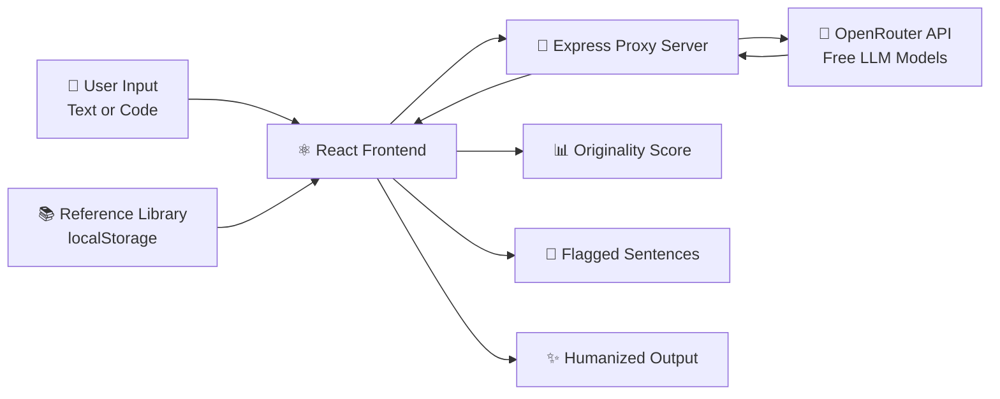

<div align="center">

# 🌌 Novara

### AI-Powered Originality & Plagiarism Detection Platform

*Catch AI-generated content. Detect plagiarism. Humanize text and code — all in one sleek, dark-themed dashboard.*

[](https://novara-one.vercel.app)
[](https://reactjs.org/)
[](https://nodejs.org/)
[](LICENSE)

[](https://vercel.com)
[](https://render.com)
[](https://openrouter.ai)

<br/>


</div>

<br/>

---

## ✨ Overview

**Novara** is a full-stack web application that helps writers, developers, and educators detect AI-generated content and plagiarism — in both **natural language text** and **source code**. Built with a premium dark UI inspired by tools like Linear, Vercel, and Cursor, it goes beyond detection by offering an AI-powered **Humanizer** that rewrites flagged content while preserving its original meaning and functionality.

> 🎯 **No backend database required** — fully functional with browser-based local storage, per-user account isolation, and a lightweight Node.js proxy for secure AI calls.

<br/>

## 🖼️ Features

<table>
<tr>
<td width="50%" valign="top">

### 📄 Text Analysis
- Drag-and-drop or paste text (supports `.txt`, `.md`, `.docx`)
- ⚡ **Fast** vs 🧠 **Deep** analysis modes
- Adjustable similarity threshold slider
- Sentence-level highlighting with hover tooltips
- AI vs Human probability breakdown
- Top-matching source documents from your corpus
- One-click **Humanize Text** rewriting
- Downloadable / copyable analysis reports

</td>
<td width="50%" valign="top">

### 💻 Code Analysis
- Supports 18+ programming languages (auto-detected)
- AI-generation pattern detection
- Plagiarism scoring against reference corpus
- Detected pattern tags (generic names, boilerplate, etc.)
- One-click **Humanize Code** — rewrites while preserving 100% functionality
- Syntax-highlighted code viewer
- Detailed before/after comparison

</td>
</tr>
<tr>
<td width="50%" valign="top">

### 📊 Dashboard
- Real-time originality trend charts
- Risk distribution pie chart
- Aggregate stats across all checks
- Recent activity feed
- Personalized **"Hi, [Name] 👋"** greeting

</td>
<td width="50%" valign="top">

### 📚 Reference Library
- Add your own custom reference documents
- Fully editable corpus per user account
- Used for real plagiarism similarity scoring
- Preview, manage, and delete documents

</td>
</tr>
<tr>
<td width="50%" valign="top">

### 🔐 Authentication
- Email + password registration & login
- Per-user data isolation — every account has its own private history & library
- Clean sign-out flow

</td>
<td width="50%" valign="top">

### 🕘 History
- Full searchable history of every check
- Filter by Text / Code
- **Click any entry to reopen the full report** — scores, highlights, sources, humanize, all intact
- Delete individual records

</td>
</tr>
</table>

<br/>

## 🎨 Design Philosophy

Novara uses a custom **dark, glassmorphic design system**:

| Element | Value |
|---|---|
| 🎨 Background | `#0B1120` |
| 🟣 Accent (Primary) | `#7C3AED` |
| 🔵 Accent (Secondary) | `#3B82F6` |
| 🟢 Success | `#22C55E` |
| 🟡 Warning | `#F59E0B` |
| 🔴 Danger | `#EF4444` |
| 🔤 Typography | Inter (Google Fonts) |

Smooth fade-in animations, animated circular gauges, gradient buttons, and a fully responsive layout across desktop, tablet, and mobile.

<br/>

## 🧠 How It Works



1. User submits text or code through the dashboard
2. The React frontend sends the content to a lightweight **Express proxy server**
3. The proxy securely calls free LLM models via **OpenRouter** (keeping API keys server-side)
4. AI-detection heuristics + Jaccard similarity scoring against the user's reference library produce an originality report
5. Optionally, the **Humanizer** rewrites flagged content using the same AI pipeline

<br/>

## 🛠️ Tech Stack

<div align="center">


</div>

<br/>

## 🚀 Getting Started

### Prerequisites
- [Node.js](https://nodejs.org/) v18 or higher
- A free [OpenRouter](https://openrouter.ai/keys) API key

### 1️⃣ Clone the repository

```bash
git clone https://github.com/kaavyaraja2006-create/novara.git
cd novara
```

### 2️⃣ Install dependencies

```bash
npm install
```

### 3️⃣ Add your API key

Open `server.js` and replace the placeholder:

```js
const OPENROUTER_API_KEY = process.env.OPENROUTER_API_KEY || 'YOUR_OPENROUTER_API_KEY';
```

> 🔑 Get a free key at [openrouter.ai/keys](https://openrouter.ai/keys)

### 4️⃣ Run the app

```bash
npm start
```

This starts **both** the React frontend (`:3000`) and the Express proxy server (`:3001`) concurrently.

Open [http://localhost:3000](http://localhost:3000) 🎉

<br/>

## 🌐 Deployment

Novara is deployed as two independent services:

| Service | Platform | Purpose |
|---|---|---|
| 🖥️ Frontend | [Vercel](https://vercel.com) | Hosts the React app |
| ⚙️ Backend | [Render](https://render.com) | Runs the Express proxy securely |

### Environment Variables

**Backend (Render):**
```
OPENROUTER_API_KEY=your_key_here
```

**Frontend (Vercel):**
```
REACT_APP_API_URL=https://your-backend-url.onrender.com
```

<br/>

## 📁 Project Structure

```
novara/
├── public/
│   └── index.html
├── src/
│   ├── components/
│   │   ├── layout/
│   │   │   ├── Sidebar.jsx
│   │   │   └── TopBar.jsx
│   │   └── CircularGauge.jsx
│   ├── pages/
│   │   ├── Login.jsx
│   │   ├── Dashboard.jsx
│   │   ├── TextAnalysis.jsx
│   │   ├── CodeAnalysis.jsx
│   │   ├── History.jsx
│   │   └── Library.jsx
│   ├── utils/
│   │   ├── auth.js          # Login/register/session
│   │   ├── gemini.js        # AI proxy calls
│   │   ├── storage.js       # Per-user localStorage
│   │   └── toast.js         # Notifications
│   ├── styles/
│   │   └── global.css
│   ├── App.jsx
│   └── index.js
├── server.js                 # Express proxy for AI calls
├── package.json
└── README.md
```

<br/>

## 🔒 Privacy & Data

- All user accounts, history, and reference library data are stored **locally in the browser** (`localStorage`), namespaced per account
- No central database — your data never leaves your device except for the AI analysis calls routed through the secure proxy
- API keys are never exposed to the frontend

<br/>

## 🗺️ Roadmap

- [ ] Real backend database for cross-device sync
- [ ] PDF upload support for text analysis
- [ ] Team/organization accounts
- [ ] Export reports as PDF
- [ ] Browser extension version

<br/>

## 🤝 Contributing

Contributions, issues, and feature requests are welcome!

1. Fork the repo
2. Create your feature branch (`git checkout -b feature/amazing-feature`)
3. Commit your changes (`git commit -m 'Add amazing feature'`)
4. Push to the branch (`git push origin feature/amazing-feature`)
5. Open a Pull Request

<br/>

## 📄 License

This project is licensed under the **MIT License**.

<br/>

<div align="center">

### 💜 Built with passion for originality and integrity in the age of AI

[](https://novara-one.vercel.app)

⭐ **If you like this project, give it a star!** ⭐

</div>
